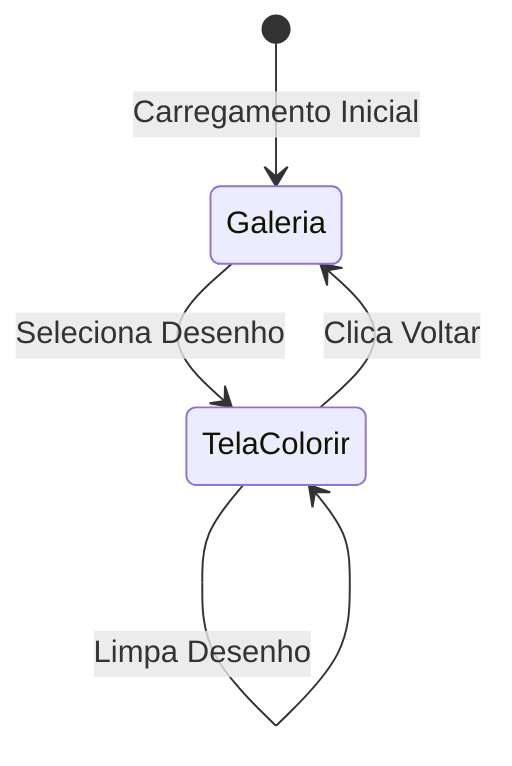

# Documento de Design

## Visão Geral

O Site de Colorir Interativo será uma aplicação web single-page desenvolvida com tecnologias modernas para garantir performance, acessibilidade e facilidade de manutenção. A aplicação será construída com foco em simplicidade de uso para crianças atípicas, com interface intuitiva e feedback visual imediato.

A arquitetura será baseada em componentes reutilizáveis, com separação clara entre lógica de apresentação, gerenciamento de estado e manipulação de SVG. O sistema utilizará HTML5, CSS3 e JavaScript vanilla (ou framework leve como React) para garantir compatibilidade ampla e performance otimizada.

## Arquitetura

### Arquitetura Geral

```
┌─────────────────────────────────────────────────────────┐
│                    Camada de Apresentação                │
│  ┌──────────────┐  ┌──────────────┐  ┌──────────────┐  │
│  │   Galeria    │  │ Tela Colorir │  │  Componentes │  │
│  │  Component   │  │  Component   │  │      UI      │  │
│  └──────────────┘  └──────────────┘  └──────────────┘  │
└─────────────────────────────────────────────────────────┘
                            │
┌─────────────────────────────────────────────────────────┐
│              Camada de Gerenciamento de Estado           │
│  ┌──────────────┐  ┌──────────────┐  ┌──────────────┐  │
│  │   Estado da  │  │  Estado do   │  │   Seleção    │  │
│  │   Galeria    │  │   Desenho    │  │   de Cor     │  │
│  └──────────────┘  └──────────────┘  └──────────────┘  │
└─────────────────────────────────────────────────────────┘
                            │
┌─────────────────────────────────────────────────────────┐
│                  Camada de Serviços                      │
│  ┌──────────────┐  ┌──────────────┐  ┌──────────────┐  │
│  │   SVG        │  │   Loader     │  │   Color      │  │
│  │  Manipulator │  │   Service    │  │   Service    │  │
│  └──────────────┘  └──────────────┘  └──────────────┘  │
└─────────────────────────────────────────────────────────┘
                            │
┌─────────────────────────────────────────────────────────┐
│                    Camada de Dados                       │
│  ┌──────────────┐  ┌──────────────┐                     │
│  │   Desenhos   │  │   Paleta     │                     │
│  │     SVG      │  │   de Cores   │                     │
│  └──────────────┘  └──────────────┘                     │
└─────────────────────────────────────────────────────────┘
```

### Fluxo de Navegação



## Componentes e Interfaces

### 1. Componente Galeria

**Responsabilidade:** Exibir todos os desenhos disponíveis organizados por categorias e permitir seleção.

**Interface:**
```typescript
interface GalleryProps {
  categories: Category[];
  onDrawingSelect: (drawingId: string) => void;
}

interface Category {
  id: string;
  name: string;
  drawings: Drawing[];
}

interface Drawing {
  id: string;
  name: string;
  thumbnailUrl: string;
  svgUrl: string;
  category: string;
}
```

**Comportamento:**
- Renderiza grid responsivo de miniaturas
- Agrupa desenhos por categoria com cabeçalhos visuais
- Implementa lazy loading para otimização
- Fornece feedback visual ao hover

### 2. Componente Tela de Colorir

**Responsabilidade:** Gerenciar a interface de colorir, incluindo desenho SVG e paleta de cores.

**Interface:**
```typescript
interface ColoringScreenProps {
  drawing: Drawing;
  onBack: () => void;
}

interface ColoringState {
  selectedColor: string;
  coloredAreas: Map<string, string>; // areaId -> color
  currentDrawing: SVGElement;
}
```

**Comportamento:**
- Carrega e renderiza SVG do desenho
- Gerencia estado de cores aplicadas
- Coordena interação entre paleta e desenho
- Fornece botões de ação (voltar, limpar)

### 3. Componente Paleta de Cores

**Responsabilidade:** Exibir cores disponíveis e gerenciar seleção.

**Interface:**
```typescript
interface ColorPaletteProps {
  colors: string[];
  selectedColor: string;
  onColorSelect: (color: string) => void;
}
```

**Comportamento:**
- Renderiza grid de cores
- Destaca cor selecionada
- Fornece feedback visual ao hover
- Suporta interação por mouse e touch

### 4. Componente Canvas SVG

**Responsabilidade:** Renderizar e gerenciar interações com o desenho SVG.

**Interface:**
```typescript
interface SVGCanvasProps {
  svgContent: string;
  selectedColor: string;
  coloredAreas: Map<string, string>;
  onAreaClick: (areaId: string, color: string) => void;
}
```

**Comportamento:**
- Renderiza SVG com áreas clicáveis
- Detecta cliques em áreas específicas
- Aplica cores às áreas
- Destaca área sob cursor
- Transforma cursor em pincel

### 5. Serviço de Manipulação SVG

**Responsabilidade:** Processar e manipular arquivos SVG.

**Interface:**
```typescript
interface SVGManipulator {
  loadSVG(url: string): Promise<SVGElement>;
  identifyColorableAreas(svg: SVGElement): ColorableArea[];
  applyColorToArea(svg: SVGElement, areaId: string, color: string): void;
  clearAllColors(svg: SVGElement): void;
  highlightArea(svg: SVGElement, areaId: string, highlight: boolean): void;
}

interface ColorableArea {
  id: string;
  element: SVGElement;
  bounds: DOMRect;
}
```

### 6. Serviço de Carregamento

**Responsabilidade:** Gerenciar carregamento de recursos.

**Interface:**
```typescript
interface LoaderService {
  loadDrawings(): Promise<Drawing[]>;
  loadDrawingsByCategory(categoryId: string): Promise<Drawing[]>;
  preloadDrawing(drawingId: string): Promise<void>;
}
```

## Modelos de Dados

### Drawing (Desenho)

```typescript
interface Drawing {
  id: string;              // Identificador único
  name: string;            // Nome do desenho
  category: string;        // Categoria (carros, animais, etc.)
  thumbnailUrl: string;    // URL da miniatura
  svgUrl: string;          // URL do arquivo SVG
  metadata: {
    width: number;         // Largura original
    height: number;        // Altura original
    areaCount: number;     // Número de áreas coloríveis
  };
}
```

### ColorableArea (Área Colorível)

```typescript
interface ColorableArea {
  id: string;              // Identificador único da área
  element: SVGElement;     // Elemento SVG correspondente
  bounds: DOMRect;         // Limites da área
  currentColor: string | null;  // Cor atual (null se não colorida)
}
```

### ColorPalette (Paleta de Cores)

```typescript
interface ColorPalette {
  colors: Color[];
  selectedColor: string;
}

interface Color {
  hex: string;             // Código hexadecimal
  name: string;            // Nome da cor
  rgb: {r: number, g: number, b: number};
}
```

### ApplicationState (Estado da Aplicação)

```typescript
interface ApplicationState {
  currentView: 'gallery' | 'coloring';
  selectedDrawing: Drawing | null;
  coloringState: {
    selectedColor: string;
    coloredAreas: Map<string, string>;
    isModified: boolean;
  };
  galleryState: {
    categories: Category[];
    loadedDrawings: Drawing[];
  };
}
```

## Estrutura de Diretórios

```
adaptAI/
├── index.html
├── css/
│   ├── main.css
│   ├── gallery.css
│   ├── coloring.css
│   └── responsive.css
├── js/
│   ├── main.js
│   ├── components/
│   │   ├── Gallery.js
│   │   ├── ColoringScreen.js
│   │   ├── ColorPalette.js
│   │   └── SVGCanvas.js
│   ├── services/
│   │   ├── SVGManipulator.js
│   │   ├── LoaderService.js
│   │   └── ColorService.js
│   └── utils/
│       ├── eventHandlers.js
│       └── validators.js
├── assets/
│   ├── drawings/
│   │   ├── carros/
│   │   ├── animais/
│   │   ├── princesas/
│   │   └── [outras categorias]/
│   └── thumbnails/
│       ├── carros/
│       ├── animais/
│       └── [outras categorias]/
└── data/
    └── drawings-catalog.json
```

## Formato dos Arquivos SVG

Os desenhos SVG devem seguir uma estrutura específica para facilitar a identificação e coloração de áreas:

```xml
<svg xmlns="http://www.w3.org/2000/svg" viewBox="0 0 800 600">
  <!-- Grupo de áreas coloríveis -->
  <g id="colorable-areas">
    <path id="area-1" d="..." fill="white" stroke="black" stroke-width="2"/>
    <path id="area-2" d="..." fill="white" stroke="black" stroke-width="2"/>
    <path id="area-3" d="..." fill="white" stroke="black" stroke-width="2"/>
  </g>
  
  <!-- Grupo de linhas (não colorível) -->
  <g id="outlines">
    <path d="..." fill="none" stroke="black" stroke-width="3"/>
  </g>
</svg>
```

**Convenções:**
- Cada área colorível deve ter um `id` único começando com "area-"
- Áreas devem ter `fill="white"` inicialmente
- Linhas de contorno devem ter `stroke-width` mínimo de 2px
- Usar `viewBox` para responsividade


## Propriedades de Correção

*Uma propriedade é uma característica ou comportamento que deve ser verdadeiro em todas as execuções válidas de um sistema - essencialmente, uma declaração formal sobre o que o sistema deve fazer. As propriedades servem como ponte entre especificações legíveis por humanos e garantias de correção verificáveis por máquina.*

### Reflexão sobre Propriedades

Após análise inicial, identifiquei as seguintes redundâncias que devem ser eliminadas:

- **Propriedades 7.2 e 7.3** são logicamente idênticas - ambas testam que limpar remove todas as cores. A Propriedade 7.2 será mantida por ser mais direta.
- **Propriedades 2.3 e 8.3** testam aspectos complementares mas não redundantes - 2.3 testa o comportamento do usuário, 8.3 testa a implementação técnica. Ambas serão mantidas.
- **Propriedades 1.1 e 1.3** podem parecer similares, mas 1.1 testa completude da galeria enquanto 1.3 testa organização por categoria. Ambas fornecem valor único.

### Propriedade 1: Completude da galeria
*Para qualquer* conjunto de desenhos disponíveis no sistema, quando a galeria é carregada, todas as miniaturas desses desenhos devem estar presentes na interface renderizada.
**Valida: Requisitos 1.1**

### Propriedade 2: Agrupamento por categoria
*Para qualquer* conjunto de desenhos com categorias atribuídas, quando a galeria é renderizada, todos os desenhos da mesma categoria devem aparecer agrupados juntos.
**Valida: Requisitos 1.2**

### Propriedade 3: Exibição completa de categoria
*Para qualquer* categoria renderizada na galeria, a interface deve exibir o nome da categoria e todos os desenhos pertencentes exclusivamente àquela categoria.
**Valida: Requisitos 1.3**

### Propriedade 4: Navegação para colorir
*Para qualquer* desenho na galeria, quando o usuário clica na miniatura daquele desenho, o sistema deve transicionar para a tela de colorir com aquele desenho específico carregado.
**Valida: Requisitos 1.4**

### Propriedade 5: Presença de desenho e paleta
*Para qualquer* desenho selecionado, quando a tela de colorir é exibida, a interface deve conter tanto o desenho SVG renderizado quanto a paleta de cores.
**Valida: Requisitos 2.1**

### Propriedade 6: Transformação do cursor
*Para qualquer* posição do mouse sobre uma área colorível do desenho, o cursor deve ter o estilo visual de pincel aplicado.
**Valida: Requisitos 2.2**

### Propriedade 7: Aplicação de cor ao clicar
*Para qualquer* área colorível e qualquer cor selecionada na paleta, quando o usuário clica naquela área, a área deve ser preenchida com a cor selecionada.
**Valida: Requisitos 2.3**

### Propriedade 8: Contenção de cor nos limites
*Para qualquer* área colorível pintada, a cor aplicada deve modificar apenas o atributo fill do elemento SVG correspondente àquela área, sem afetar elementos adjacentes.
**Valida: Requisitos 2.4**

### Propriedade 9: Substituição de cor
*Para qualquer* área já colorida, quando o usuário clica naquela área com uma nova cor selecionada, a cor anterior deve ser completamente substituída pela nova cor.
**Valida: Requisitos 2.5**

### Propriedade 10: Marcação visual de cor selecionada
*Para qualquer* cor na paleta, quando o usuário clica naquela cor, ela deve receber marcação visual indicando que está selecionada (classe CSS, borda, etc.).
**Valida: Requisitos 3.2**

### Propriedade 11: Uso consistente da cor selecionada
*Para qualquer* cor selecionada na paleta, todas as operações de pintura subsequentes devem usar aquela cor até que uma nova cor seja selecionada.
**Valida: Requisitos 3.3**

### Propriedade 12: Exclusividade de seleção de cor
*Para qualquer* sequência de seleções de cor, apenas uma cor deve estar marcada como selecionada em qualquer momento dado.
**Valida: Requisitos 3.4**

### Propriedade 13: Espessura mínima de linhas
*Para qualquer* desenho SVG renderizado na tela de colorir, todos os elementos de linha de contorno devem ter stroke-width maior ou igual a 2 pixels.
**Valida: Requisitos 4.1**

### Propriedade 14: Destaque de área sob cursor
*Para qualquer* área colorível sob o cursor do mouse, aquela área deve ter destaque visual aplicado (mudança de opacidade, borda, etc.) enquanto o cursor estiver sobre ela.
**Valida: Requisitos 4.3**

### Propriedade 15: Estado inicial sem cor
*Para qualquer* desenho recém-carregado, todas as áreas coloríveis devem ter o atributo fill definido como "white", "transparent" ou equivalente (sem cor aplicada).
**Valida: Requisitos 4.4**

### Propriedade 16: Tamanho mínimo de elementos interativos
*Para qualquer* elemento interativo renderizado (botões, cores da paleta, miniaturas), suas dimensões devem ser maiores ou iguais a 44x44 pixels.
**Valida: Requisitos 5.1**

### Propriedade 17: Preservação de estado ao voltar
*Para qualquer* estado da galeria antes de navegar para a tela de colorir, quando o usuário clica no botão voltar, o sistema deve restaurar aquele estado exato da galeria (posição de scroll, categoria expandida, etc.).
**Valida: Requisitos 5.3**

### Propriedade 18: Tamanho mínimo de fonte
*Para qualquer* elemento de texto renderizado na interface, o tamanho da fonte deve ser maior ou igual a 16 pixels.
**Valida: Requisitos 5.5**

### Propriedade 19: Manutenção de funcionalidades em layouts responsivos
*Para qualquer* tamanho de viewport (largura de tela), todas as funcionalidades principais (selecionar desenho, escolher cor, pintar área, limpar, voltar) devem estar acessíveis e funcionais.
**Valida: Requisitos 6.3**

### Propriedade 20: Equivalência touch e mouse
*Para qualquer* evento de toque em uma área colorível, o resultado deve ser idêntico ao de um evento de clique de mouse na mesma área (aplicar a cor selecionada).
**Valida: Requisitos 6.4**

### Propriedade 21: Limpeza completa do desenho
*Para qualquer* desenho com uma ou mais áreas coloridas, quando o usuário clica no botão limpar, todas as áreas devem retornar ao estado inicial sem cor.
**Valida: Requisitos 7.2**

### Propriedade 22: Preservação de cor selecionada ao limpar
*Para qualquer* cor selecionada na paleta, quando o usuário clica no botão limpar, a cor selecionada deve permanecer a mesma (não deve ser deselecionada).
**Valida: Requisitos 7.4**

### Propriedade 23: Formato SVG válido
*Para qualquer* arquivo de desenho carregado pelo sistema, o arquivo deve ser um documento SVG válido que pode ser parseado pelo navegador.
**Valida: Requisitos 8.1**

### Propriedade 24: Unicidade de IDs de áreas
*Para qualquer* desenho SVG processado, todos os elementos identificados como áreas coloríveis devem ter atributos id únicos dentro daquele documento.
**Valida: Requisitos 8.2**

### Propriedade 25: Modificação do atributo fill
*Para qualquer* área colorível pintada, o sistema deve modificar o atributo fill do elemento SVG correspondente para o valor hexadecimal da cor selecionada.
**Valida: Requisitos 8.3**

## Tratamento de Erros

### Erros de Carregamento de Recursos

**Cenário:** Falha ao carregar arquivo SVG ou miniatura

**Tratamento:**
- Exibir placeholder visual indicando erro
- Registrar erro no console para debugging
- Permitir tentativa de recarregamento
- Não bloquear carregamento de outros desenhos

```typescript
async function loadDrawing(url: string): Promise<SVGElement> {
  try {
    const response = await fetch(url);
    if (!response.ok) {
      throw new Error(`HTTP ${response.status}: ${response.statusText}`);
    }
    const svgText = await response.text();
    const parser = new DOMParser();
    const svgDoc = parser.parseFromString(svgText, 'image/svg+xml');
    
    // Verificar erros de parsing
    const parserError = svgDoc.querySelector('parsererror');
    if (parserError) {
      throw new Error('SVG inválido: erro de parsing');
    }
    
    return svgDoc.documentElement as unknown as SVGElement;
  } catch (error) {
    console.error('Erro ao carregar desenho:', error);
    throw new DrawingLoadError(url, error);
  }
}
```

### Erros de Manipulação SVG

**Cenário:** Área clicada não possui ID ou não é colorível

**Tratamento:**
- Ignorar clique silenciosamente
- Não aplicar cor
- Manter estado atual
- Registrar warning no console

```typescript
function handleAreaClick(event: MouseEvent, selectedColor: string): void {
  const target = event.target as SVGElement;
  const areaId = target.getAttribute('id');
  
  if (!areaId || !areaId.startsWith('area-')) {
    console.warn('Clique em elemento não colorível:', target);
    return;
  }
  
  applyColorToArea(target, selectedColor);
}
```

### Erros de Estado Inconsistente

**Cenário:** Nenhuma cor selecionada ao tentar pintar

**Tratamento:**
- Selecionar automaticamente primeira cor da paleta
- Aplicar cor padrão
- Notificar usuário visualmente (opcional)

```typescript
function ensureColorSelected(state: ColoringState): string {
  if (!state.selectedColor) {
    const defaultColor = COLOR_PALETTE[0].hex;
    state.selectedColor = defaultColor;
    console.warn('Nenhuma cor selecionada, usando padrão:', defaultColor);
    return defaultColor;
  }
  return state.selectedColor;
}
```

### Erros de Compatibilidade

**Cenário:** Navegador não suporta funcionalidades necessárias

**Tratamento:**
- Detectar suporte a SVG, eventos touch, etc.
- Exibir mensagem amigável se incompatível
- Sugerir navegadores compatíveis
- Fornecer fallback quando possível

```typescript
function checkBrowserCompatibility(): CompatibilityResult {
  const issues: string[] = [];
  
  if (!document.implementation.hasFeature("http://www.w3.org/TR/SVG11/feature#BasicStructure", "1.1")) {
    issues.push('SVG não suportado');
  }
  
  if (!('ontouchstart' in window) && !navigator.maxTouchPoints) {
    console.info('Dispositivo touch não detectado');
  }
  
  return {
    compatible: issues.length === 0,
    issues
  };
}
```

## Estratégia de Testes

### Abordagem Dual de Testes

Este projeto utilizará uma abordagem combinada de testes unitários e testes baseados em propriedades para garantir correção abrangente:

- **Testes Unitários:** Verificam exemplos específicos, casos extremos e condições de erro
- **Testes Baseados em Propriedades:** Verificam propriedades universais que devem ser válidas para todas as entradas

Juntos, eles fornecem cobertura abrangente: testes unitários capturam bugs concretos, testes de propriedade verificam correção geral.

### Testes Unitários

Os testes unitários focarão em:

**1. Componentes de UI:**
- Renderização correta de galeria com desenhos específicos
- Comportamento de clique em miniaturas
- Transições de estado entre telas
- Renderização de paleta de cores

**2. Manipulação SVG:**
- Parsing de arquivos SVG específicos
- Identificação de áreas coloríveis
- Aplicação de cores a elementos específicos
- Limpeza de cores

**3. Gerenciamento de Estado:**
- Seleção de cor
- Rastreamento de áreas coloridas
- Navegação entre telas
- Preservação de estado

**4. Casos Extremos:**
- Desenho sem áreas coloríveis
- Clique fora de áreas válidas
- Múltiplos cliques rápidos
- Desenho vazio ou corrompido

**Exemplo de Teste Unitário:**
```typescript
describe('ColorPalette', () => {
  it('deve marcar cor como selecionada ao clicar', () => {
    const palette = new ColorPalette(['#FF0000', '#00FF00', '#0000FF']);
    const redButton = palette.getColorButton('#FF0000');
    
    redButton.click();
    
    expect(redButton.classList.contains('selected')).toBe(true);
  });
  
  it('deve desmarcar cor anterior ao selecionar nova', () => {
    const palette = new ColorPalette(['#FF0000', '#00FF00']);
    
    palette.selectColor('#FF0000');
    palette.selectColor('#00FF00');
    
    expect(palette.getSelectedColor()).toBe('#00FF00');
    expect(palette.getColorButton('#FF0000').classList.contains('selected')).toBe(false);
  });
});
```

### Testes Baseados em Propriedades

**Framework:** Utilizaremos **fast-check** (https://github.com/dubzzz/fast-check) para JavaScript/TypeScript, que é uma biblioteca madura e bem mantida para testes baseados em propriedades.

**Configuração:** Cada teste de propriedade deve executar no mínimo 100 iterações para garantir cobertura adequada do espaço de entrada.

**Formato de Anotação:** Cada teste baseado em propriedade DEVE ser anotado com um comentário referenciando explicitamente a propriedade de correção do documento de design:

```typescript
// **Feature: site-colorir, Property 7: Aplicação de cor ao clicar**
```

**Mapeamento de Propriedades para Testes:**

Cada propriedade de correção será implementada por UM ÚNICO teste baseado em propriedade:

**Propriedade 1 - Completude da galeria:**
```typescript
// **Feature: site-colorir, Property 1: Completude da galeria**
fc.assert(
  fc.property(
    fc.array(arbitraryDrawing(), { minLength: 1, maxLength: 50 }),
    (drawings) => {
      const gallery = new Gallery(drawings);
      const renderedIds = gallery.getRenderedDrawingIds();
      const expectedIds = drawings.map(d => d.id);
      
      return renderedIds.length === expectedIds.length &&
             expectedIds.every(id => renderedIds.includes(id));
    }
  ),
  { numRuns: 100 }
);
```

**Propriedade 7 - Aplicação de cor ao clicar:**
```typescript
// **Feature: site-colorir, Property 7: Aplicação de cor ao clicar**
fc.assert(
  fc.property(
    arbitraryDrawing(),
    arbitraryAreaId(),
    arbitraryColor(),
    (drawing, areaId, color) => {
      const canvas = new SVGCanvas(drawing);
      canvas.selectColor(color);
      canvas.clickArea(areaId);
      
      return canvas.getAreaColor(areaId) === color;
    }
  ),
  { numRuns: 100 }
);
```

**Propriedade 9 - Substituição de cor:**
```typescript
// **Feature: site-colorir, Property 9: Substituição de cor**
fc.assert(
  fc.property(
    arbitraryDrawing(),
    arbitraryAreaId(),
    arbitraryColor(),
    arbitraryColor(),
    (drawing, areaId, color1, color2) => {
      const canvas = new SVGCanvas(drawing);
      
      canvas.selectColor(color1);
      canvas.clickArea(areaId);
      
      canvas.selectColor(color2);
      canvas.clickArea(areaId);
      
      return canvas.getAreaColor(areaId) === color2;
    }
  ),
  { numRuns: 100 }
);
```

**Propriedade 12 - Exclusividade de seleção de cor:**
```typescript
// **Feature: site-colorir, Property 12: Exclusividade de seleção de cor**
fc.assert(
  fc.property(
    fc.array(arbitraryColor(), { minLength: 2, maxLength: 20 }),
    fc.array(fc.integer({ min: 0, max: 19 }), { minLength: 1, maxLength: 10 }),
    (colors, selectionSequence) => {
      const palette = new ColorPalette(colors);
      
      selectionSequence.forEach(index => {
        if (index < colors.length) {
          palette.selectColor(colors[index]);
        }
      });
      
      const selectedColors = palette.getSelectedColors();
      return selectedColors.length === 1;
    }
  ),
  { numRuns: 100 }
);
```

**Propriedade 21 - Limpeza completa do desenho:**
```typescript
// **Feature: site-colorir, Property 21: Limpeza completa do desenho**
fc.assert(
  fc.property(
    arbitraryDrawing(),
    fc.array(fc.tuple(arbitraryAreaId(), arbitraryColor()), { minLength: 1, maxLength: 10 }),
    (drawing, coloredAreas) => {
      const canvas = new SVGCanvas(drawing);
      
      // Pintar várias áreas
      coloredAreas.forEach(([areaId, color]) => {
        canvas.selectColor(color);
        canvas.clickArea(areaId);
      });
      
      // Limpar
      canvas.clear();
      
      // Verificar que todas as áreas estão sem cor
      const allAreas = canvas.getAllAreaIds();
      return allAreas.every(areaId => {
        const color = canvas.getAreaColor(areaId);
        return color === 'white' || color === 'transparent' || color === '';
      });
    }
  ),
  { numRuns: 100 }
);
```

### Geradores Personalizados (Arbitraries)

Para testes baseados em propriedades eficazes, criaremos geradores inteligentes:

```typescript
// Gerador de desenhos válidos
function arbitraryDrawing(): fc.Arbitrary<Drawing> {
  return fc.record({
    id: fc.uuid(),
    name: fc.string({ minLength: 3, maxLength: 30 }),
    category: fc.constantFrom('carros', 'animais', 'princesas', 'dinossauros'),
    thumbnailUrl: fc.webUrl(),
    svgUrl: fc.webUrl(),
    metadata: fc.record({
      width: fc.integer({ min: 400, max: 1200 }),
      height: fc.integer({ min: 400, max: 1200 }),
      areaCount: fc.integer({ min: 5, max: 30 })
    })
  });
}

// Gerador de IDs de área válidos
function arbitraryAreaId(): fc.Arbitrary<string> {
  return fc.integer({ min: 1, max: 50 }).map(n => `area-${n}`);
}

// Gerador de cores hexadecimais válidas
function arbitraryColor(): fc.Arbitrary<string> {
  return fc.hexaString({ minLength: 6, maxLength: 6 }).map(hex => `#${hex}`);
}

// Gerador de categorias válidas
function arbitraryCategory(): fc.Arbitrary<string> {
  return fc.constantFrom(
    'carros', 'esportes', 'paisagens', 'locais', 'comidas',
    'insetos', 'animais', 'bandeiras', 'castelos', 'piratas',
    'sereias', 'princesas', 'monstros', 'ocupações', 'dinossauros'
  );
}
```

### Testes de Integração

Além de testes unitários e de propriedade, implementaremos testes de integração para:

- Fluxo completo: galeria → seleção → colorir → voltar
- Interação entre componentes (paleta + canvas)
- Carregamento e parsing de arquivos SVG reais
- Responsividade em diferentes viewports

### Cobertura de Testes

**Meta de Cobertura:**
- Cobertura de linha: mínimo 80%
- Cobertura de branch: mínimo 75%
- Todas as 25 propriedades de correção implementadas como testes

**Ferramentas:**
- Jest para execução de testes
- fast-check para testes baseados em propriedades
- Istanbul/nyc para relatórios de cobertura

## Considerações de Performance

### Otimizações de Renderização

1. **Lazy Loading de Miniaturas:**
   - Carregar miniaturas apenas quando visíveis no viewport
   - Usar Intersection Observer API
   - Placeholder durante carregamento

2. **Debouncing de Eventos:**
   - Debounce de eventos mousemove para destaque de áreas
   - Throttle de eventos de scroll na galeria

3. **Virtualização de Lista:**
   - Para galerias com muitos desenhos (>100)
   - Renderizar apenas itens visíveis
   - Reciclar elementos DOM

### Otimizações de SVG

1. **Simplificação de Paths:**
   - Usar ferramentas como SVGO para otimizar SVGs
   - Remover metadados desnecessários
   - Simplificar paths complexos

2. **Caching de SVG:**
   - Cache de SVGs parseados em memória
   - Evitar re-parsing do mesmo desenho

3. **Uso de CSS para Cores:**
   - Aplicar cores via classes CSS quando possível
   - Reduzir manipulação direta do DOM

### Otimizações de Carregamento

1. **Code Splitting:**
   - Carregar código da tela de colorir apenas quando necessário
   - Separar código de cada categoria se aplicável

2. **Compressão de Assets:**
   - Gzip/Brotli para arquivos estáticos
   - Minificação de JS/CSS

3. **Service Worker:**
   - Cache de desenhos visitados
   - Funcionamento offline básico

## Considerações de Acessibilidade

### WCAG 2.1 Nível AA

1. **Contraste de Cores:**
   - Razão de contraste mínima 4.5:1 para texto
   - Razão de contraste mínima 3:1 para elementos UI

2. **Navegação por Teclado:**
   - Todos os elementos interativos acessíveis via Tab
   - Indicadores visuais de foco claros
   - Atalhos de teclado para ações principais

3. **Leitores de Tela:**
   - Atributos ARIA apropriados
   - Textos alternativos para imagens
   - Anúncios de mudanças de estado

4. **Tamanhos de Toque:**
   - Mínimo 44x44 pixels para todos os alvos de toque
   - Espaçamento adequado entre elementos

### Suporte para Crianças Atípicas

1. **Simplicidade Visual:**
   - Interface limpa sem distrações
   - Elementos grandes e claros
   - Feedback visual imediato

2. **Tolerância a Erros:**
   - Sem penalidades por cliques errados
   - Fácil desfazer (limpar)
   - Sem limites de tempo

3. **Consistência:**
   - Comportamento previsível
   - Mesma interação em todos os desenhos
   - Feedback consistente

## Tecnologias e Dependências

### Stack Tecnológico

**Frontend:**
- HTML5
- CSS3 (com CSS Grid e Flexbox)
- JavaScript ES6+ (ou TypeScript para type safety)
- Opcional: Framework leve como Preact ou Alpine.js

**Testes:**
- Jest (test runner e assertions)
- fast-check (property-based testing)
- @testing-library/dom (testes de componentes)
- Istanbul/nyc (cobertura de código)

**Build Tools:**
- Vite ou Parcel (bundler rápido)
- PostCSS (processamento CSS)
- ESLint (linting)
- Prettier (formatação)

**Dependências Externas:**
- Nenhuma dependência obrigatória para funcionalidade core
- Todas as funcionalidades implementáveis com Web APIs nativas

### Estrutura de Arquivos SVG

Os desenhos devem ser criados ou convertidos seguindo estas diretrizes:

1. **Formato:**
   - SVG 1.1 ou superior
   - ViewBox definido para responsividade
   - Dimensões relativas (não absolutas)

2. **Estrutura:**
   - Grupo `colorable-areas` contendo todas as áreas pintáveis
   - Grupo `outlines` contendo linhas de contorno
   - IDs únicos para cada área (area-1, area-2, etc.)

3. **Otimização:**
   - Paths simplificados
   - Sem estilos inline desnecessários
   - Sem metadados de ferramentas de edição

## Próximos Passos

Após aprovação deste design, o próximo passo será criar o plano de implementação detalhado (tasks.md) que dividirá o desenvolvimento em tarefas incrementais e gerenciáveis, cada uma construindo sobre as anteriores até a conclusão do sistema completo.
